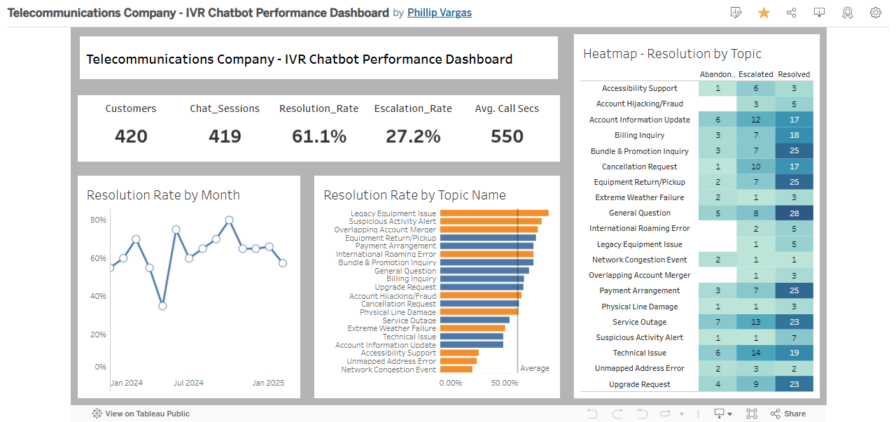
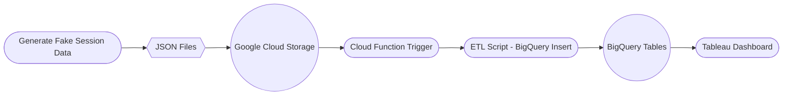

# Telecommunications Company IVR Chatbot Dashboard

## Overview
This project showcases an end-to-end data pipeline for a telecommunications company’s IVR (Interactive Voice Response) Chatbot. From data collection and storage in Google Cloud Platform (GCP) to the final data visualization in Tableau, the project simulates how real-world call session data could be managed, transformed, and analyzed.

## Project Goal
- **Data Collection**: Generate **Fake IVR Chatbot Session JSON** data and store it in a Google Cloud Storage bucket.  
- **Data Transformation**: Use Python (pandas) to clean, transform, and load the JSON files into Google BigQuery tables.  
- **Data Visualization**: Connect the BigQuery tables to a Tableau Dashboard for real-time performance insights into the IVR chatbot’s resolution rates, escalation rates, average call durations, and more.

## Project Method

1. **Session Data Generation**  
   - Created a Python script leveraging the OpenAI ChatGPT API and a custom `FakeSessionDataGenerator` class to programmatically generate fake IVR chatbot session JSON files.  
   - **Dependencies**:  
     ```
     pandas==2.2.2
     faker==36.1.1
     openai==1.65.3
     python-dotenv
     seaborn
     ```

2. **ETL Script for Data Processing**  
   - Implemented a Python class `FakeSessionDataETL` to ingest the raw JSON files, clean the data using pandas, and prepare it for database insertion.  
   - This script performs standard data cleaning routines such as handling null values, normalizing data types, and applying transformations to align with the BigQuery schema.

3. **Google Cloud Storage (GCS) Integration**  
   - Chose GCP due to its scalability and ability to handle large volumes of call data.  
   - Stored all generated JSON files in a GCS bucket, simulating the ingestion of IVR chatbot session data in near real time.

4. **Google Cloud Functions & BigQuery**  
   - Configured a Cloud Function trigger to automatically process new files in the GCS bucket.  
   - The trigger runs the Python ETL process and updates two BigQuery tables:  
     - `telecommunications-ivr-chatbot-dashboard.session_dataset.raw_session_data`  
     - `telecommunications-ivr-chatbot-dashboard.session_dataset.conversation_data`  
   - Frequency (e.g., every four hours) can be tailored to batch or real-time data flow.

5. **Tableau Dashboard**  
   - Connected the BigQuery tables to Tableau using the native BigQuery connector.  
   - **Dashboard Name**: *Telecommunications Company - IVR Chatbot Performance Dashboard*  
   - **Public Link**: [View Dashboard](https://public.tableau.com/views/TelecommunicationsCompany-IVRChatbotPerformanceDashboard/Dashboard1?:language=en-US&:sid=&:redirect=auth&:display_count=n&:origin=viz_share_link)  
   - The dashboard provides insights into:  
     - High-level KPIs: Customers, Chat Sessions, Resolution Rate, Escalation Rate, and Average Call Duration  
     - Resolution Rate trends by Month  
     - Resolution Rate by Topic Name, with comparisons against an overall average  
     - Heatmap showing Abandoned, Escalated, and Resolved counts by Topic  

   

## Project Flow Diagram




## Project Outcome
- A fully functional simulation of a large-scale IVR chatbot data pipeline, showcasing:
  - **Scalability**: Leveraging Google Cloud for storage and data processing.  
  - **Reliability**: Automated data ingestion and cleaning via Python and Cloud Functions.  
  - **Actionable Insights**: Interactive Tableau dashboards connected to live BigQuery data.

## Data Dictionaries

### `telecommunications-ivr-chatbot-dashboard.session_dataset.raw_session_data`

| **Column Name**       | **Data Type** | **Description**                                                                                       |
|-----------------------|---------------|-------------------------------------------------------------------------------------------------------|
| session_id            | STRING        | Unique identifier for each IVR chatbot session.                                                      |
| customer_id           | STRING        | Anonymized identifier to distinguish different callers.                                              |
| call_start_time       | TIMESTAMP     | The date and time when the session started.                                                           |
| call_end_time         | TIMESTAMP     | The date and time when the session ended.                                                             |
| call_duration_sec     | INT64         | Total call duration in seconds.                                                                       |
| conversation          | STRING        | A raw transcript or placeholder text for the IVR dialogue.                                           |
| initial_intent        | STRING        | The first detected intent of the call (e.g., billing inquiry, technical support).                     |
| resolution_status     | STRING        | Status of the session (e.g., “Resolved”, “Escalated”, “Abandoned”).                                   |
| escalation_flag       | STRING        | Indicator if the session was escalated to a live agent (e.g., “Y” or “N”).                            |
| customer_sentiment    | STRING        | Basic sentiment or mood of the customer based on available cues (e.g., “Positive”, “Negative”).       |
| system_error_flag     | STRING        | Indicates if any system error occurred during the session (e.g., “Y” or “N”).                         |
| ivr_outcome_code      | STRING        | A code representing the chatbot’s final outcome or handoff result.                                    |
| topic_type            | STRING        | Category/type of topic (e.g., “Billing”, “TechSupport”).                                             |
| topic_name            | STRING        | Specific name or label of the topic discussed (e.g., “Payment Issue”, “Modem Setup”).                 |
| source_file           | STRING        | The originating file name from which the data was ingested.                                          |

### `telecommunications-ivr-chatbot-dashboard.session_dataset.conversation_data`

| **Column Name**    | **Data Type** | **Description**                                                                 |
|--------------------|---------------|---------------------------------------------------------------------------------|
| session_id         | STRING        | Foreign key referencing `raw_session_data.session_id`.                          |
| customer_id        | STRING        | Anonymized identifier to distinguish different callers.                         |
| turn_number        | INT64         | Sequential turn number of the conversation.                                     |
| timestamp          | TIMESTAMP     | Date and time of the specific turn or message.                                  |
| speaker            | STRING        | Identifies who spoke (e.g., “Customer”, “Chatbot”, “Agent”).                   |
| text               | STRING        | The text or IVR prompt.                                                        |
| intent_detected    | STRING        | Indicates whether and what intent was recognized for this turn.                |
| intent_name        | STRING        | Name of the recognized intent (if applicable).                                 |
| confidence_score   | FLOAT64       | Confidence level in the recognized intent (range: 0.0 to 1.0).                 |

## Project Folder Structure
```
Telecommunications_IVR_Chatbot_Dashboard/
├── imgs/
├── data/
│   ├── session_etls/
│   ├── session_creation_logs/
│   ├── session_batch_files/
├── notebooks/
│   └── FakeSessionDataGenerator_NOTEBOOK.ipynb
└── README.md.txt
```

## Key Skills Demonstrated
- **Data Engineering**: Generating synthetic JSON data, building ETL pipelines, leveraging GCP Cloud Functions, and managing data in BigQuery.  
- **Python (pandas)**: Cleaning and transforming raw session data into analytics-ready formats.  
- **SQL & BigQuery**: Creating and updating BigQuery tables, writing efficient queries for analysis.  
- **Tableau**: Connecting to BigQuery to visualize key performance metrics in real time.  

## NEXT STEPS
- **Integrate Customer Demographics**  
  Expand the existing data model to include demographic information (e.g., age groups, locations, or account tenure). This allows for deeper segmentation of resolution rates and more targeted performance insights.

- **Leverage Advanced AI Agent Frameworks**  
  Utilize state-of-the-art NLP/NLU platforms to analyze call transcripts and user interactions beyond standard chatbot logs. Independent sentiment and topic analysis can yield a more comprehensive view of customer issues and feedback.

- **Enhance Dashboard Visualizations**  
  Introduce additional metrics and visuals—such as time-of-day, day-of-week patterns, sentiment trends, and correlation heatmaps—to facilitate more granular performance analysis and data-driven recommendations.